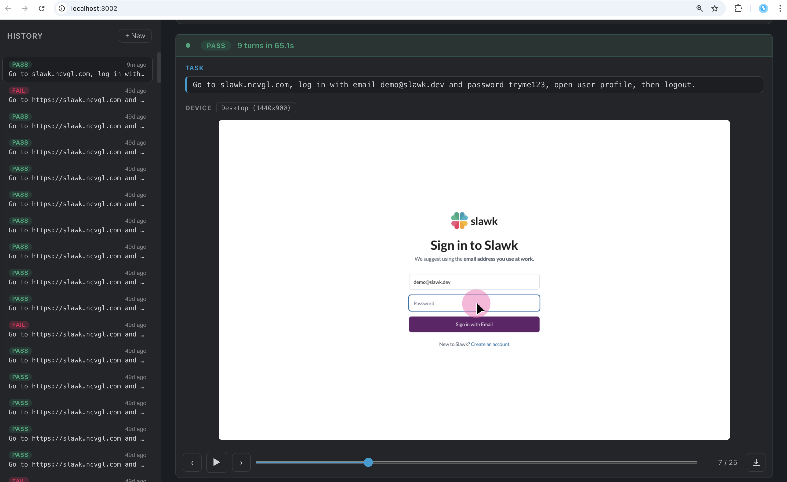

# QA as a Service



Drive a real browser with OpenAI's Computer-Use model to execute end-to-end QA prompts and report results.

## Setup

```bash
pnpm install
pnpm exec playwright install chromium
```

Copy `.env.example` to `.env` and fill in your key:

```bash
cp .env.example .env
# then edit .env and set OPENAI_API_KEY=sk-...
```

## Start

```bash
pnpm dev
```

Starts backend on `:4001` and frontend on `:3002`.

## Frontend

Open <http://localhost:3002>. Pick a preset (or write a custom prompt), hit Run, watch the live screenshots and verdict. The history tab lists past runs.

## Backend API

The frontend is a thin client over a plain HTTP API — you can hit it directly.

```bash
# 1. Submit a job
curl -sX POST http://localhost:4001/api/run \
  -H 'Content-Type: application/json' \
  -d '{"prompt":"Go to example.com and check the homepage loads."}'
# → {"runId":"<uuid>"}

# 2. Stream live progress (SSE, optional)
curl -N http://localhost:4001/api/run/<runId>/events

# 3. Fetch the full result (works during or after the run)
curl http://localhost:4001/api/run/<runId>/data
```

Other endpoints: `GET /api/runs` (list), `GET /api/run/:id/screenshots/:filename`, `GET /api/run/:id/video`, `POST /api/run/:id/stop`.

Completed runs are persisted to `screenshots/<runId>/run.json`.

## Parallel runs

Each `POST /api/run` spawns its own Playwright browser and returns immediately with a `runId`. Fire as many as your machine and OpenAI rate limits can handle:

```bash
for prompt in "Test login" "Test signup" "Test profile edit"; do
  curl -sX POST http://localhost:4001/api/run \
    -H 'Content-Type: application/json' \
    -d "{\"prompt\":\"$prompt\"}" &
done
wait
```

Poll `/api/run/:id/data` per `runId` for results.

## Specifying a device

There is no `device` API field — the target device is inferred from the prompt by `gpt-4o-mini`. Mention it explicitly:

```
Test on Pixel 7. Go to example.com and ...
```

Recognized presets: `desktop` (default), `iphone_14`, `iphone_14_pro_max`, `ipad_pro_11`, `pixel_7`, `galaxy_s23_ultra`, `galaxy_tab_s8`.

Device names that appear as test *content* (e.g. "search for iPhone specs") are ignored — only phrases like "test on X" / "on Pixel" change the emulated device.

## Project layout

```
app/         Next.js routes and UI
server/      Fastify API + agent loop + Playwright driver
screenshots/ Run artifacts and run.json files (gitignored)
```

## How it works

Each run is a loop between the OpenAI Computer-Use model and a real Playwright browser:

1. The agent gets the prompt + (from turn 2 onwards) a screenshot of the current page.
2. It responds with one of three tools — `goto_url`, `computer` (click/type/scroll/keypress/…), or `file_upload` — or with a final message containing a `RESULT: pass | platform_bug | agent_failure` verdict.
3. We execute the tool calls against the Playwright page, capture a new screenshot, and feed it back as the next turn's input.
4. The loop ends when the model returns a verdict message, when the [stuck detector](server/stuck-detector.ts) sees the page hasn't changed across recent turns, or when `maxTurns` (30) is hit.

The target device is extracted from the prompt by a cheap `gpt-4o-mini` call before the loop starts (see [`server/device-extractor.ts`](server/device-extractor.ts)), so the Playwright browser launches with the right viewport, user-agent, and touch settings.

### Token management

Naive Computer-Use loops blow up fast: every turn sends *all* prior screenshots back to the model, and each screenshot is ~1600 input tokens. By turn 20 you're shipping 30k+ tokens of stale pixels per call.

The agent runs in `"cheap"` mode by default ([`server/agent-loop.ts`](server/agent-loop.ts)) where we manage the conversation history ourselves instead of using OpenAI's `previous_response_id`. Before each call, [`buildCheapInput`](server/agent-loop.ts) rewrites old items in place:

- **Old screenshots → 1x1 placeholder PNG.** Only the most recent `MAX_SCREENSHOTS` (= 2) `computer_call_output` items keep their real image; everything older is swapped for a 1x1 transparent PNG (~0 tokens). The model still sees the *sequence* of past states existed, just without their pixel content.
- **Old reasoning → empty summary.** Reasoning summaries are dropped from older turns the same way.
- **All action history is kept.** Tool calls, function calls, `goto_url`s, and verdict-format instructions are tiny in tokens but high-value context — the model needs to know what it has already tried.

The result: input tokens per turn stay roughly flat regardless of run length, instead of growing linearly with the number of turns. The alternative `"stateful"` mode (toggleable in `agent-loop.ts`) uses `previous_response_id` and pays full price for the entire history — useful as a baseline to measure the savings against.
